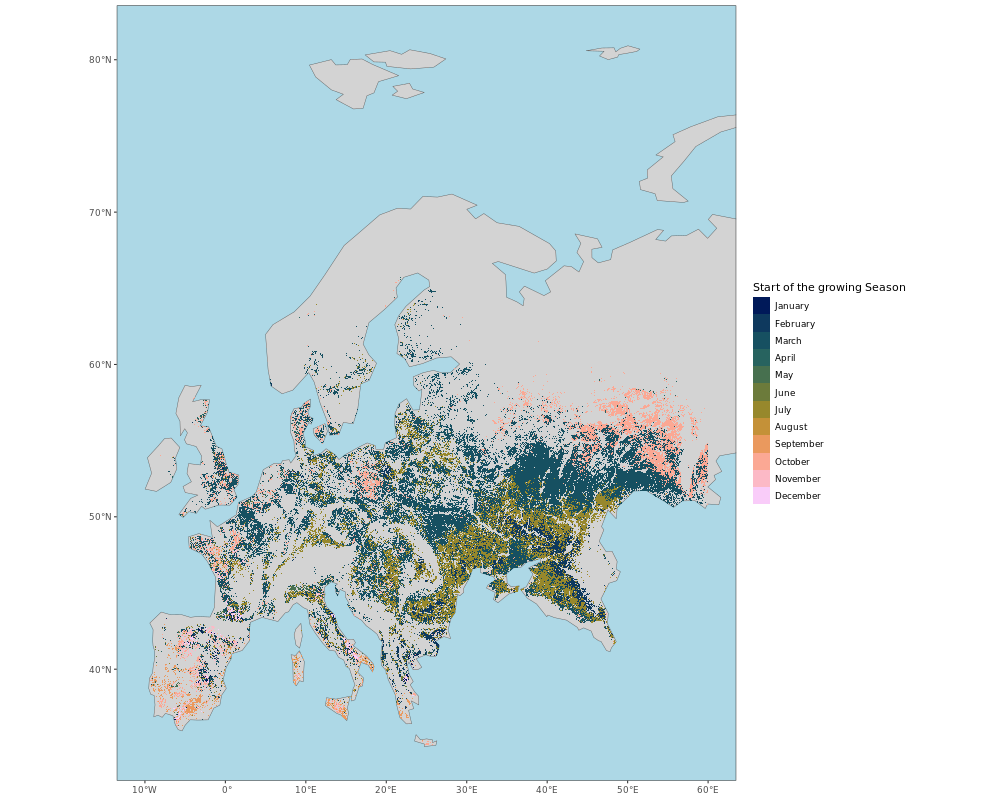

# crop_masks_results

Some results for the crop masks from ASAP

## Description

These plots show:

-  the start of the growing season (sos)
-  the end of the growing season (eos)
-  the length of the growing season (in dekads, i.e. 10-day periods)

When a pixel has two or more growing seasons, only the longest season data are represented.

## Input data

[ASAP crop masks](https://mars.jrc.ec.europa.eu/asap/download.php) intersected with the [ESA-CCI-LC](https://www.esa-landcover-cci.org/).

- ESA-CCI-LC: for the period 2014-2020, the crop classes of the annual landcover datasets have been intersected in order to identify areas where the crop fields are persistent over time (ESA_2014_2020).
- The 10-day ASAP crop masks have been intersected with ESA_2014_2020 (both the ASAP crop masks and ESA_2014_2020 have been upscaled to a spatial resolution of 300 meters, i.e. the spatial resolution of FAPAR data from Global Copernicus Land)

## EUROPE

